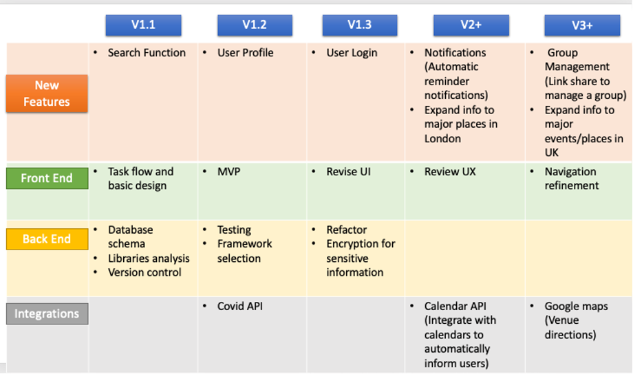
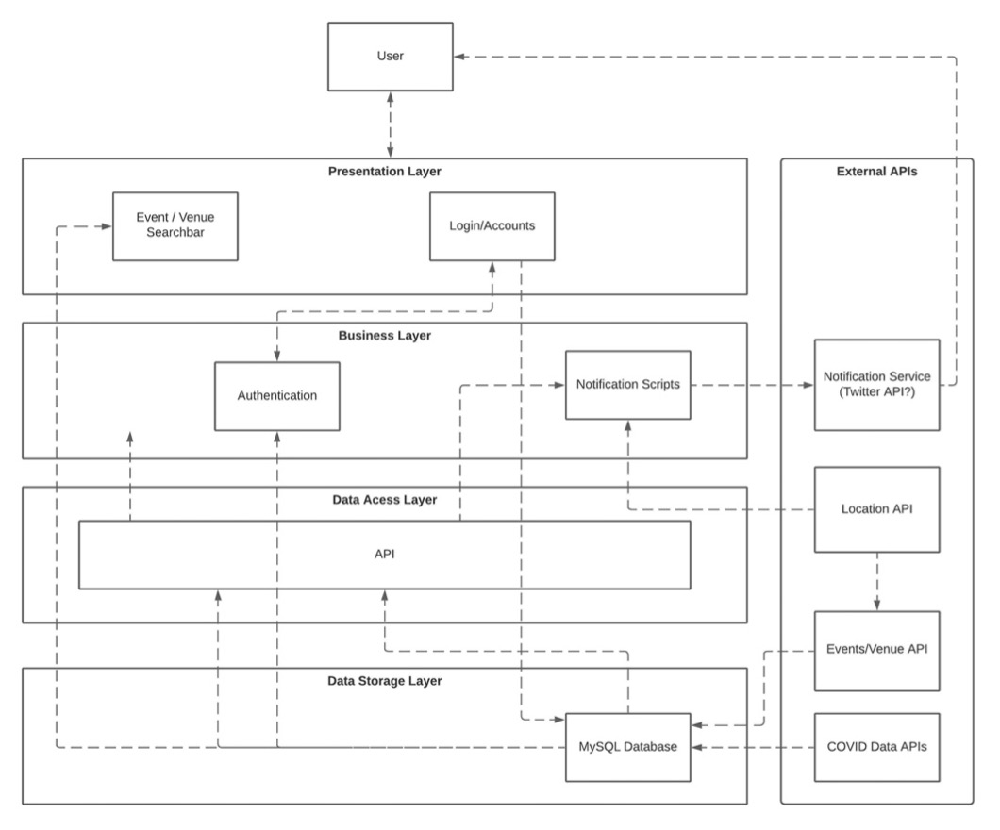

# HOMEWORK WEEK 2 (Final)

## Group 3:

- Alana Hall
- Karishma Thaladi
- Lola Adeyemi
- Mam Begay Joof
- Rabia Sohag
- Renee-Louise Nzegbulem

## Submission

#### 1. Your group needs to decide what kind of project you are going to work on and lock in your decision.

Application

#### 2. You need to submit a free style paper that describes your project on a high level. Please cover the following questions:

##### 2.1 What are you building?

We are building a web application designed to help people understand and be compliant with COVID-19 rules/requirements for key events/places in the UK. 

##### 2.2 What does it do or what kind of problem does it solve?

Within the UK, the lack of standarisation around COVID-19 rules/requirements makes it challenging to know what compliance is required to attend major events/places. Each event or place tends to have different requirements and attendees can be affected and lost in the different requirements. Our MVP will initially focus on major music events. As music events are restarting from the initial pandemic postponement, we believe we are providing a first of a kind application within the UK. We will deem our application successful when we deliver an application which a user can interact with and receive COVID-19 information regarding an upcoming music event.

Our application will provide users with a one-stop service for locating crucial COVID-19 rules/requirements for an upcoming major music event in London. Our application will provide COVID-19 information on rules, requirements, and key metrics for major events/places in the UK. We will initially start with providing information for music events within London, with a roadmap looking to deliver an application that provides information on major events/venues within London and eventually the UK. For our MVP, we are focusing on use cases 2 & 3 in the use cases table which corresponds to v1.2 on the roadmap, see below:

##### Use cases

Number | As a... | I want to... | So that...
-------| --------| ------------ | -------------
 1 | User (concert goer) | Visit the website and have the option of creating an account or continuing as a guest. (Ideally, I would want to be able create an account on the website by signing up via Facebook, Twitter or with my email).  If I am continuing as a guest, then I would need to be asked some basic and relevant questions about who I am. (i.e. Age, exemptions). Side note: This could be done using a lightbox/ modal pop up which captures the details of users.  | Sign up option: I can create an account that stores my profile and stops me from having to fill in my details all over again before searching for information on a particular venue. If there is no information on the venue, then it will tell the user that we have no information on this at present and give the logged in user an option to leave some tips below if they have been to the venue. If a user is not logged in, then it would prompt the user to create an account first.   Continue as a guest option: So that I do not have to save my information to any database and hence I can search on behalf of others quickly.
 2 | User (concert goer) | Search for a venue by name using the search bar, which filters through matching options as I search in a dropdown menu and mentions the location in brackets. (Example: O2 Arena (London, Greenwich)) | This will allow me to search specifically for the venue that I’m looking for easily. 
 3 | User (concert goer) | Find out latest news on the COVID cases in the area, restrictions, and requirements for a specific concert venue in London.  | I can assess the latest COVID risks posed in that area and find out what I need to do (I.e., lateral flow test) and by when to ensure a smooth entry to the venue. I may even decide that based on the information presented to me, I do not want to attend at all anymore.
 4 | User (concert goer) | Have the option to create additional profiles for who I will be attending the concert with, with their age etc? | I can search on behalf of friends and family who have different circumstances to me and be given tailored information for each person attending the concert.

##### Roadmap – Version 1.1
 

##### 2.3. What are key features of your system?

View| Feature| Description 
----| -------| ----------- 
All | Accessible | -	Easy to view buttons -	Keyboard only navigation -	Colour blind friendly colours
All | Navigation | -	Ability to navigate through pages
Search Page | Analytics | -	Covid analytics
Search Page | Mail to | -	Feature to mail search information

##### 2.4. Provide a sample architecture diagram of your system

##### 2.5	Describe the team approach to the project work: how are you planning to distribute the workload, how are you managing your code, how are you planning to test your system.

The team approach for this project is the agile software development methodology. Agile will help us deliver the software that focuses on incremental development, prioritising testing and user feedback in order to adjust the software to meets users’ need. The way that we have planned to distribute the workload is by using the Scrum model. 

In this model, we have assigned a scrum master who leads the work and a product owner who is responsible for managing the Product Backlog. Everyone on the project team is also part of the development team who delivers releasable increment of products at the end of each sprint. We are all equally responsible for the quality and success of the project. 

The project team brainstormed a list of key requirements for the software which were broken down into smaller and more precise items. These items are stored in the product backlog items and details such as description and order are also added.

At the beginning of each sprint, we conduct a sprint planning meeting where we outline the work to be performed for the sprint. The team selects tasks for the sprint, then finds out what each item means and who owns it. In this meeting, the following questions are answered:
1.	What are we going to work on?
2.	How are we going to do it?

Daily scrum meetings are also required every day once a sprint begins for fifteen minutes to check the progress toward the sprint goal and make adjustments if necessary. Currently, we are not conducting daily scrum meetings due to it being a part time project. However, once the project goes full time then we will include daily scrum in the schedule and each developer will answer the following three questions during the meetings:
1.	What did you do yesterday?
2.	What will you do today?
3.	Is anything blocking your progress?

Developers work through the sprint tasks with estimated deadlines for each sprint. Once a sprint is complete, developers conduct a sprint review meeting to get feedback to ensure that the piece of software or product has met the key requirements and the revision of the product backlog can take place based on the feedbacks.

Our project team ends each week with a sprint retrospective meeting. This allows us to plan ways to increase quality and effectiveness. We reflect on our previous sprint by discussing the following points:
1.	What went well during the sprint
2.	What problems were encountered
3.	How those problems were solved or unsolved

The ways that we have planned to manage our code are through pair programming and code reviews. Pair programming is where two developers pair up to work on programming tasks. Both developers communicate effectively to share knowledge and produce better solutions because two heads are better than one.
We will also use code reviews, where a developer takes a look at another developer’s code to find faults or improvement in it. This will help us ensure that our code is bug free and of a very high quality standard.

We are planning to test the system by using unit testing and end to end testing. Unit testing is a software testing model that tests individual components of the software to validate each component of the software performs as designed. End to end testing will also be uses to test all actions that a real user might perform on the system. This will ensure that the system behave as expected.

