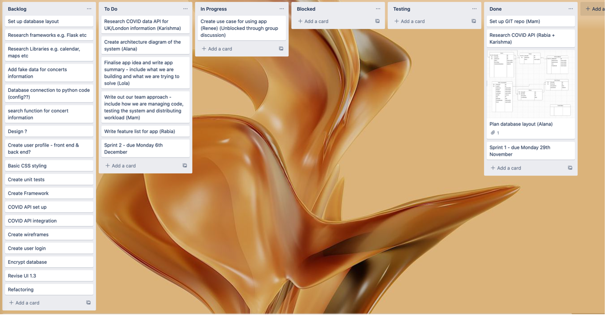

# Project Management Weekly Status Report 2 (Group 3)

1.	Please describe your project idea. If this changes from the previous week, please describe how; if it does not change, please just copy the main objectives of the project. 

An online application that informs a user on covid information regarding an event type in London	

2.	What did the group (or each member of the group) work on this week?
a.	What progress has been made? 
b.	How would you evaluate your progress (e.g., exceptional, good, satisfactory, bad, etc.). Why?

A.	Use cases created
APIs researched 
Homework 2 completed
Backlog updated
Sprint 2 completed and spring 3 created during sprint planning session

B.	Good! We are continuing to work as a team, just eager to start coding and getting things together

3.	What were the main challenges this week? 
a.	How did you solve any issues encountered? What worked and what didn’t?
Making sure we have left enough time for coding. Going through this in our sprint planning has helped

b.	What is still to be solved and who is in charge of the task? How did you approach the issue so far? 
We have to confirm framework we are going to use i.e. Django or flask

c.	Please specifically mention any help you need from your instructor (we will also give general feedback and provide our thoughts and ideas, but this is your chance to specifically point to aspects where you are complete stuck). 

4.	What are the group’s main objectives for next week?
Work on sprint 3!

Project Management Weekly Status Report

 

