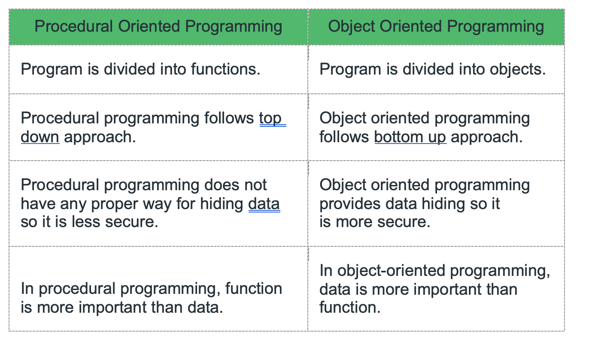
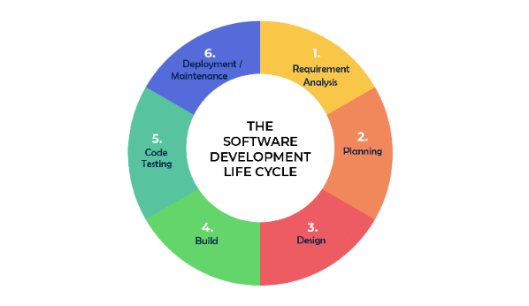
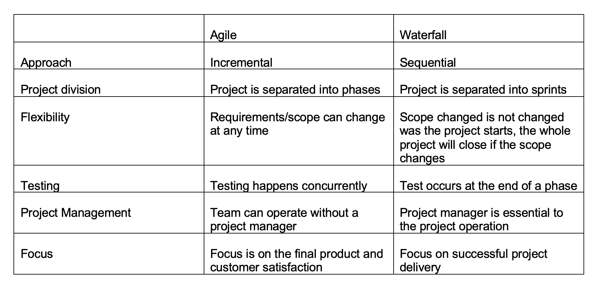
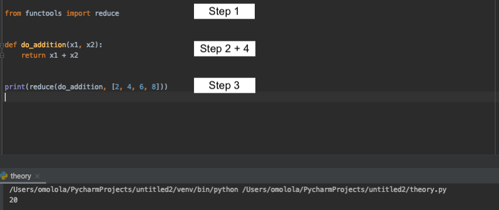
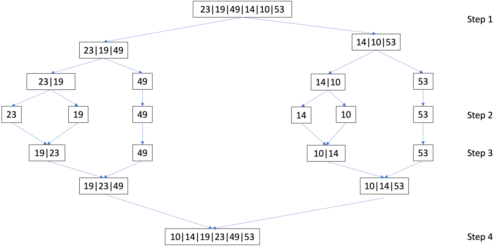
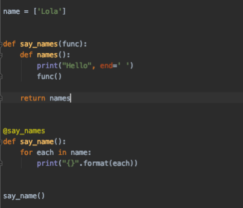
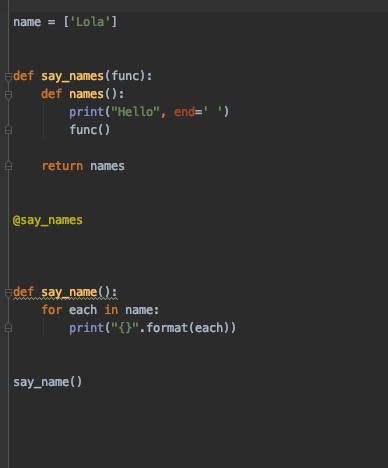
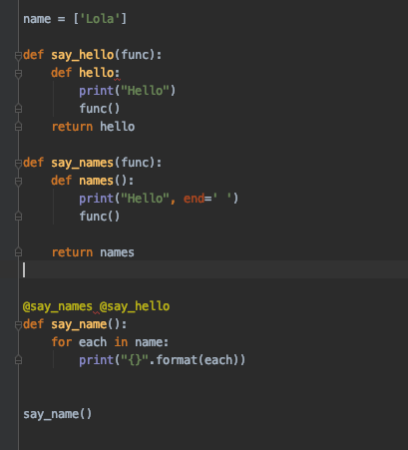
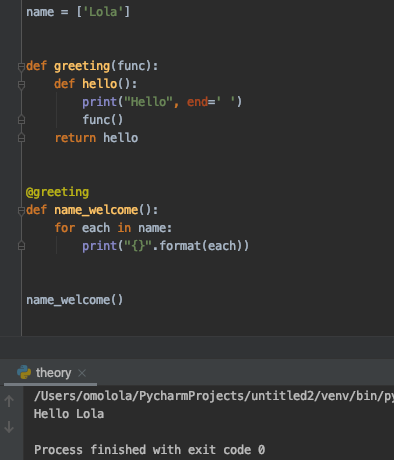

THEORY QUESTIONS ASSIGNMENT

Software Stream

KEY NOTES

•	This assignment to be completed at student’s own pace and submitted before given deadline. 

•	There are 10 questions in total and each question is marked on a scale 1 to 10. The maximum possible grade for this assignment is 100 points. 

•	Students are welcome to use any online or written resources to answer these questions. 

•	The answers need to be explained clearly and illustrated with relevant examples where necessary. Your examples can include code snippets, diagrams or any other evidence-based representation of your answer. 

 Theory questions	10 point each
1.	How does Object Oriented Programming differ from Process Oriented Programming?
Object Oriented programming (OOP) is a programming that uses classes and objects. It is used to structure a software program into simple, reusable pieces of code (called classes), which are used to create individual instances of objects. 
Classes can contain functions, called methods available only to objects of that type. These functions are defined within the class and perform some action helpful to that specific type of object.
Procedural Programming can be defined as structured programming. Programming process is carried in out in procedures, also known as routines, and it simply consist of a series of computational steps to be carried out. During the programme execution, any given procedure might be called at any point, including by other procedures or itself. In summary, it is a list of instructions to tell the computer what to do step-by-step.

The key differences are summarised below:

images/Screenshot 2021-12-11 at 20.53.52.png

2.	What's polymorphism in OOP?

Polymorphism define methods in the child class that have the same name as the methods in the parent class. A child class inherits all the methods from the parent class. Polymorphism allows the method inherited from the parent class to be re-implemented in the child class.

3.	What's inheritance in OOP?

Inheritance is a way of defining a new class with no modification to an existing class. The new class is called the child class and it inherits properties and characteristics from its parent class. In inheritance, the child class inherits the methods from the parent class. However, it is possible to modify a method in a child class that it has inherited from the parent class.
class BaseClass:
  Body of base class
class DerivedClass(BaseClass):
  Body of derived class

4.	If you had to make a program that could vote for the top three funniest people in the office, how would you do that? How would you make it possible to vote on those people?

6.	I would create a function that generated a random 4-digit number code against all the names in the office
7.	Each person in the office will then receive their 4-digit code 
b.	I would create a database for the voting application. Within this database their will be a minimum of three tables: 1. Table with a list of all names in the office for voting 2. Table with a list of all names for creating a vote 3.
c.	I would create a simple webframe which will ask the user to select their name from the table number 2
d.	The user will then be given three opportunities to vote for the funniest people in the office
e.	Each vote will increase a count against the user name in table number 1
f.	Once submitted it will remove the name from the options in table number 2 (so they cannot double vote)
g.	Depending on the office size the database will be updated in batch processing
h.	Once all votes have been submitted/time has lapsed an algorithm will sort the names and vote counts in order using
i.	The names with the highest three counts will then be deemed the funniest people 

5.	What's the software development cycle?
The software development cycle is the application of standard practices to build software applications. In this cycle, it simply outlines each task required to put together a software application. The software development cycle consists of 6 stages:

 
1.	Requirement analysis – understand what the current problems are and getting input from people such as customers  on the requirements.
2.	Planning – this is learning the resources that are required, understanding the costs and the risks involved. It also looks at removing risks
3.	Design – this is when the software specifications are turned into a design specification
4.	Build – the software build i.e. actual development then occurs in this stage. The designs specification are used for the software build.
5.	Testing – The software build is tested for bugs and these are fixed
6.	Deployment/Maintenance -  the software is deployed and maintained.

The software development cycle can be repeated as often as needed.

6.	What's the difference between agile and waterfall?
Waterfall is the traditional method of project management.  It is described as a linear sequential cycle method. In software development, the whole development in defined in phases and it follows a linear, sequential approach where phases flow downwards to the next phase.

The Agile method is a newer approach to project management. It is described as a continuous iteration  In software development, the development is defined in small increments and the management of the project has a greater focus on flexibility, collaboration and people processes.
A key summary of differences can be found in the table below:

7.	What is a reduced function used for?
Reduce is a in-built function that replicates a mathematical technique called  reduction. The reduction method means rewriting of an expression/fraction/radical into a simpler form. In python, the reduce function is used to return a single value. The function can accepts three parameters i.e. function, sequence and initial value. The reduce function then calls the function within the parameter and then the first two items from the sequence and a result is returned. The function is then called again using the result from first reduction and the next value in the sequence. The process keeps until all values in the sequence have been reduced to a singular value. If the initial parameter is used, the process starts from the initial value in the sequence.

The reduce function is explained further using the diagram and steps below:

 
Steps corresponding to diagram:
1.	In Python 3 the reduce function was moved to functool module. In Python 2, import is not needed as it’s an built-in function. In step one the function is imported
2.	The calculation function is written
3.	The reduce function is called. The function calls the “do_addition” function and goes through the sequence of numbers given
4.	The “do_addition” function returns the calculation to the reduce function which keeps going through the sequence until one value remains
5.	The answer is printed as a single value of 20

8.	How does merge sort work
Merge sort is a sorting algorithm. It divides the input array and then sorts. It starts by finding the middle of the array and it then divides the array elements into 2 halves (step 1). It will keep dividing into two halves till the array size becomes a singular (one) element (step 2). Following this, one element arrays are then combined into two-element arrays, and they are sorted in the process (step 3). The arrays will keep merging and sorting until the initial array is sorted (step 4). The following example diagram corresponds to the previously written steps:
 

Advantage of merge sort
•	Faster than simple sorting algorithms
•	Consistent running time

Disadvantage of merge sort
•	It will sort an array even if the array is sorted
•	It requires additional memory for the temporary divided arrays that is formed, although this is an additional memory space of 0(n)

9.	Generators - Generator functions allow you to declare a function that behaves like an iterator, i.e. it can be used in a for loop. What is the use case?

A generator is a special function which doesn’t return a single value, instead, it returns an iterator object with a sequence of values. In a generator function, a yield statement is used rather than a return statement. The difference between yield and return is that yield returns a value and pauses the execution while maintaining the internal states and later continues from there on successive calls. Whereas the return statement returns a value and terminates the execution of the function.

Generators are a clear and concise way compared to the interator class counterpart. They can be used to create infinite stream of data e.g.

def all_even():
    n = 0
    while True:
        yield n
        n += 2

10.	Decorators - A page for useful (or potentially abusive?) decorator ideas. What is the return type of the decorator?
A decorator can be any callable python object and it can modify either a function or a class. With regards to functions, a decorator is a function that takes another function as its argument and returns yet a modified version of it. Decorators allow for the extension of an existing function without any modification to the original source code. As decorators are used for design pattern they can be implemented badly or well, the following shows examples of these implementations.
Bad decorators:
Poor naming -

Space between decorator and function

 
Multiple decorators on one line
 

A good decorator will be properly referenced, just above the function it is calling, one per line and calls a proper function and not a class. The following is an example of a good decorator:
 
 

